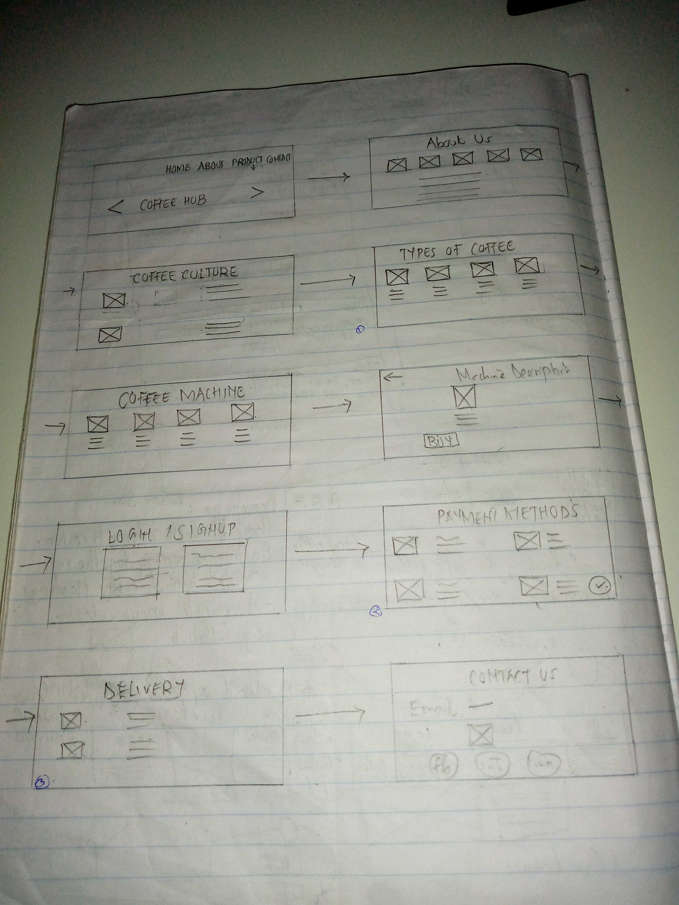

   
# BACKGROUND.
The Western style of drinking coffee started in 1999 thanks to  Java House.Considering the high regard the Western world has for Kenyan coffee,it is curious that it took so long to develop its own coffee culture.(SantaFerelo,2015). For years the coffee culture has been existent and embraced in different countries.
Throughout our research,we noticed a lack of pride in the consumption  of  Kenyan coffee where people don't embrace the different coffee practices and varieties despite being ranked as the best producer of coffee.
This led us to find innovative ways of bringing back the coffee culture in kenya in order to make people take pride in coffee and coffee consumption.

# PROBLEM STATEMENT.
How might we motivate the working class to take pride in consuming Kenyan coffee so as to immerse themselves in the coffee culture?
# OBJECTIVES.
Bringing awareness of the coffee culture to people.
Educating people on different coffee varieties,blends and machines.
Allow people to customize their own coffee and give them a personal experience.

# PERSONAS.
 #Persona1: Rachel Peter: UI/UX Designer

#Persona1: Godfrey Peter:Software Developer

#Persona1: Lindsey Aganda:Business lady

# PRODUCT USER FLOW

# PRODUCT DESIGN SKETCHES
 

### FEATURES OF THE PRODUCT.
#### A SHOP SECTION:

This section displays different products on our website:

###### Coffee Machines.

###### Coffee Accessories.

###### Coffee Products:

This section will allow our user to navigate and view the varieties of products of their choice.

These sections contain features like adding to cart,check points and adding different products to their wishlist.

##### A HOME SECTION:

This contains brief slides in the form of carousels that display different items we have available,top selling items and items on discount .

##### CUSTOMIZING OF COFFEE:

This section allows our user to customize their own coffee and mix different blends.
Customizing coffee is an integral part of our website because it gives coffee education to the users of the website.
 This section displays different coffee varieties around the world that the user can explore.

#### DEVELOPMENT REQUIREMENTS

 Languages

Javascript

Python

HTML/CSS

Bootstrap

# Framework
Django:

Django provides a dynamic CRUD (create, read, update and delete) interface, configured with admin models and generated via introspection. CRUD is used to describe the basic database commands, which means the interface facilitates viewing, changing, and searching for information.Django will help in keeping the user information private and only accessible to them and  admin for review.

# Heroku

 Heroku is a container-based cloud Platform as a Service (PaaS). Developers use Heroku to deploy, manage, and scale modern apps. Our platform is elegant, flexible, and easy to use, offering developers the simplest path to getting their apps to market.Heroku will aid the django application.

# SQlite database

SQLite is an in-process library that implements a self-contained, serverless, zero-configuration, transactional SQL database engine.

The code for SQLite is in the public domain and is thus free for use for any purpose, commercial or private.

# Goals for the release.

The database should be able to store the different coffee varieties and machines.

The user should be able to filter different coffee varieties and machines in order to buy them.

The user should be able to customize their own coffee with their custom label.

The user should be able to learn more about coffee and how to brew it.

# Open issues

Whether our products will load offline on our website.

If our sqlite database will suit our website.

<table>
    <tr>
      <th style="border: 1px solid black"> Task </th>
      <th style="border: 1px solid black"> Date </th>
    </tr>
    <tr>
      <td style="border: 1px solid black"> Testing </td>
      <td style="border: 1px solid black"> 12/11/2021 </td>
    </tr>
    <tr>
     <td style="border: 1px solid black"> Final pitching </td>
     <td style="border: 1px solid black"> 17/11/2021 </td>
    </tr>
    <tr>
     <td style="border: 1px solid black"> Product release </td>
     <td style="border: 1px solid black"> 20/11/2021 </td>
    </tr>
</table>